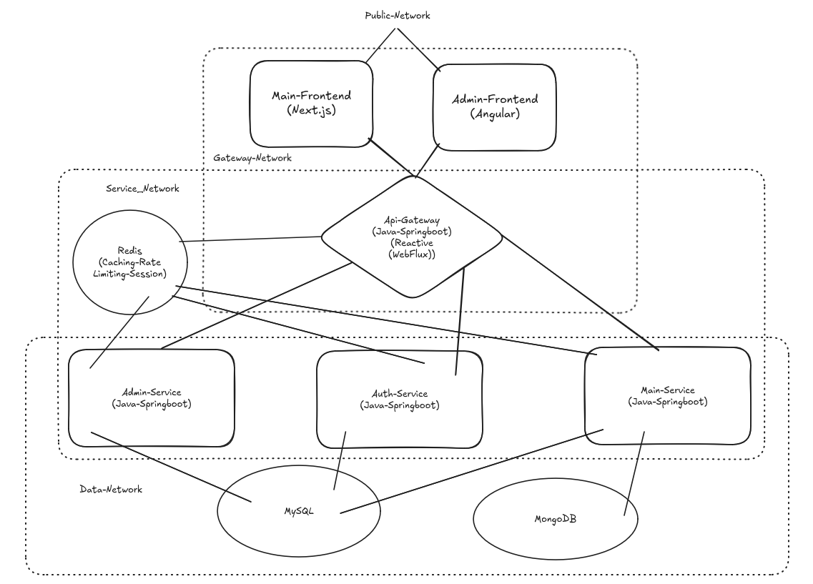

# Game Discovery Platform - Microservices Architecture

## Overview

The **Game Discovery Platform** is a comprehensive, production-ready microservices-based system for discovering, reviewing, and managing video games. The platform provides users with game browsing, commenting, favoriting, and searching capabilities, while offering administrators full CRUD operations for games, characters, companies, and genres.

---

## System Architecture

## Tech Stack (Overall)

- **Java 21** with Spring Boot 3.x
- **Spring Cloud Gateway** (API Gateway)
- **Spring Security** (Authentication)
- **Spring Data JPA** (MySQL)
- **Spring Data MongoDB** (User/Coach profiles)
- **Spring Cache** + **Redis** (Caching)
- **JWT** (Token-based auth)
- **Spring Mail** + **Thymeleaf** (Email templates)
- **Maven** (Build tool)
- **Next.js**
- **Angular**
- **Tailwind**
- **TypeScript**
- **Docker**

### Port Configuration

| Service | Port | Purpose |
|---------|------|---------|
| **API Gateway** | 8080 | Single entry point for all clients |
| **Auth Service** | 8081 | User authentication & JWT generation |
| **Main Service** | 8082 | Game browsing, comments, favorites, sliders |
| **Admin Service** | 8083 | Administrative CRUD operations |

---

### Libraries & Utilities

| Library | Purpose |
|---------|---------|
| JJWT (0.11.5) | JWT generation and validation |
| Lombok | Boilerplate code reduction |
| BCrypt | Password hashing |
| Resilience4j | Circuit breaker implementation |
| Project Reactor | Reactive programming for Gateway |

## Microservices

### 1. API Gateway (`/APIGatway`)

**Role:** Single entry point, security enforcement, traffic management

**Responsibilities:**
- JWT token validation (signature, expiration, issuer, audience)
- Role-based access control (ADMIN vs. CUSTOMER)
- Rate limiting (IP-based for public endpoints, user-based for secured endpoints)
- Circuit breaker pattern with fallback responses
- Request routing to downstream services
- Header injection (`X-Gateway-Key`, `X-User-ID`, `X-User-Role`)

**Key Files:**
- `GatewayConfig.java` - 50+ route definitions
- `AuthenticationFilter.java` - JWT validation & header injection
- `AdminRoleFilter.java` - Admin-only endpoint protection
- `RouterValidator.java` - Open vs secured endpoint classification
- `JwtUtil.java` - JWT parsing and validation logic

---

### 2. Auth Service (`/AuthService`)

**Role:** User identity and access management

**Responsibilities:**
- User registration (CUSTOMER role)
- Admin registration (ADMIN role - internal only)
- Login authentication with password validation
- JWT generation with configurable expiration (2h default / 30d with remember me)
- HttpOnly cookie management
- Gateway security filtering (blocks direct access)

**Endpoints:**
| Method | Endpoint | Description |
|--------|----------|-------------|
| POST | `/api/auth/login` | Authenticate user, returns JWT cookie |
| POST | `/api/auth/register` | Register new customer |
| POST | `/api/auth/admin/register` | Register new admin (internal) |

**JWT Structure:**
json
{
  "sub": "123",
  "role": "CUSTOMER",
  "iss": "game-platform-auth",
  "aud": "game-platform-api",
  "iat": 1700000000,
  "exp": 1700007200
}